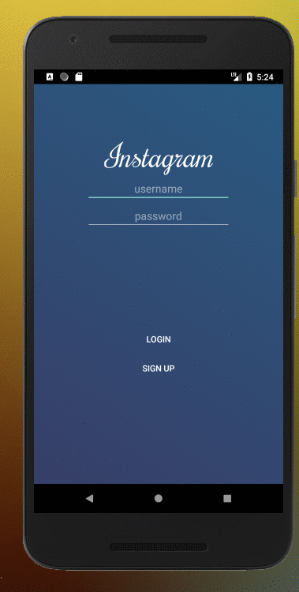

# Project 3 - *Parstagram*

**Parstagram** is a photo sharing app using Parse as its backend.

Time spent: **22** hours spent in total

## User Stories

The following **required** functionality is completed:

- [X] Style the login page to look like the real Instagram login page.
- [X] User can sign up to create a new account using Parse authentication
- [X] User can log in and log out of his or her account
- [X] The current signed in user is persisted across app restarts
- [X] User can take a photo, add a caption, and post it to "Instagram"
- [X] User can view the last 20 posts submitted to "Instagram"
- [X] User can pull to refresh the last 20 posts submitted to "Instagram"
- [X] User can tap a post to view post details, including timestamp and caption.

The following **optional** features are implemented:

- [X] Style the feed to look like the real Instagram feed.
- [X] User should switch between different tabs - viewing all posts (feed view), capture (camera and photo gallery view) and profile tabs (posts made) using a Bottom Navigation View.
- [ ] User can load more posts once he or she reaches the bottom of the feed using infinite scrolling.
- [X] Show the username and creation time for each post
- [X] After the user submits a new post, show an indeterminate progress bar while the post is being uploaded to Parse
- User Profiles:
   - [X] Allow the logged in user to add a profile photo
   - [X] Display the profile photo with each post
   - [X] Tapping on a post's username or profile photo goes to that user's profile page
- [ ] User can comment on a post and see all comments for each post in the post details screen.
- [X] User can like a post and see number of likes for each post in the post details screen.
- [ ] Create a custom Camera View on your phone.
- [X] Run your app on your phone and use the camera to take the photo

The following **additional** features are implemented:

- [X] I added an animation gradient to the sign in screen
- [X] I have a grid view enabled in the profile screen of the user's posts

Please list two areas of the assignment you'd like to **discuss further with your peers** during the next class (examples include better ways to implement something, how to extend your app in certain ways, etc):

1. I would like to talk more about how to implement a custom camera because this would be a very useful feature in a lot of apps.
2. I would like to talk more about the way to implement commenting into parse with arrays.

## Video Walkthrough

Here's a walkthrough of implemented user stories:

GIF created with [RecordIt](http://recordit.co/).

## Credits

List an 3rd party libraries, icons, graphics, or other assets you used in your app.

- [Android Async Http Client](http://loopj.com/android-async-http/) - networking library

## Notes

I had a lot of challenges implementing the camera feature into the app. However, this is a very important skill to know.
## License

    Copyright [2018] [Isabel Greiner]

    Licensed under the Apache License, Version 2.0 (the "License");
    you may not use this file except in compliance with the License.
    You may obtain a copy of the License at

        http://www.apache.org/licenses/LICENSE-2.0

    Unless required by applicable law or agreed to in writing, software
    distributed under the License is distributed on an "AS IS" BASIS,
    WITHOUT WARRANTIES OR CONDITIONS OF ANY KIND, either express or implied.
    See the License for the specific language governing permissions and
    limitations under the License.
